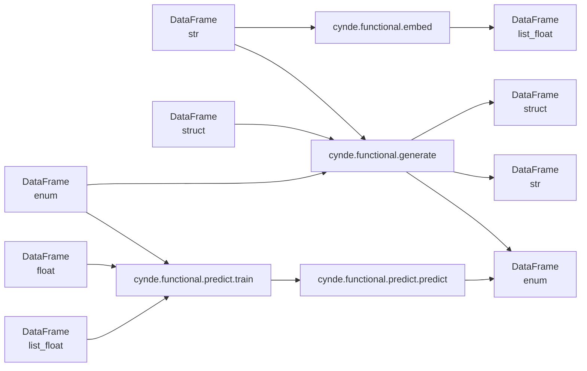

# Cynde: A Framework for Scalable and Flexible LLM-Powered Data Processing 🌿✨
python -m pip install pathto/Cynde

Hard refactor ongoing, shamelessly pushing to main for interactive debugging with modal image constructions. The Readme are auto generated and the codebase has multiple md used for autoprompting during development.

## Introduction

Cynde is a Python framework designed to streamline the integration of large language models (LLMs) with the modern data science stack, such as Polars DataFrames and decision tree ensembles, for efficient and scalable data processing. The framework provides a set of modular and composable tools for tasks such as embedding generation, structured text generation, and predictive modeling, with a focus on leveraging the power of LLMs and serverless computing.

Cynde offers two main behavioral patterns for interacting with LLMs:

1. Compatibility with OpenAI API-compatible servers, including popular LLMs like OpenAI's GPT models and self-hosted solutions like llama.cpp or OpenLLaMA
2. Self-hosted deployments using open-source models like Meta's LLaMA and Hugging Face's text-generation-inference (TGI) and text-embedding-inference (TEI) servers, managed by Cynde through Modal

The framework is designed to be flexible and adaptable to various LLM backends, allowing users to choose the most suitable option for their needs, whether it's a cloud-based API or a self-hosted solution.

Cynde integrates with Logfire, an observability platform, to provide powerful monitoring and insights into the performance and behavior of LLM-powered data processing pipelines. By leveraging Logfire's automatic instrumentation and Pydantic model recording capabilities, Cynde enables users to gain deep visibility into the execution and performance of their workflows, making it easier to identify bottlenecks, optimize resource utilization, and ensure the reliability of their applications.

One of the key features of Cynde is its ability to match Polars' parallel nature, either by scaling to the maximum tokens/calls limit of the OpenAI-compatible server (hence the limit becomes the rate limit of the provider) or by exploiting the highly optimized TGI and TEI servers, which use Rust-based LLM inference with continuous batching.

TGI and TEI are toolkits for deploying and serving LLMs, enabling high-performance text generation and embedding for the most popular open-source models. They implement various optimizations and features, such as tensor parallelism for faster inference on multiple GPUs, token streaming using Server-Sent Events (SSE), continuous batching of incoming requests for increased total throughput, and optimized transformers code for inference using Flash Attention and Paged Attention on the most popular architectures.

By leveraging Modal's autoscaling capabilities, Cynde can efficiently scale the TGI and TEI deployments to handle large workloads, with the scaling limits being determined by the available resources on the Modal cloud platform.

## Key Features

### OpenAI API-Compatible Server Integration

Cynde is compatible with any OpenAI API-compatible server, including popular LLMs like OpenAI's GPT models and self-hosted solutions like llama.cpp or OpenLLaMA. This allows users to leverage the power of LLMs while maintaining flexibility in their deployment options.

### Serverless LLM Integration

Cynde seamlessly integrates with serverless computing platforms like Modal for massively parallel LLM processing. It supports self-hosted deployments using open-source models like Meta's LLaMA and Hugging Face's TGI and TEI servers. These self-hosted deployments are managed by Cynde through Modal, ensuring scalability and efficiency.

### Polars DataFrames

Built on top of Polars, a fast and efficient DataFrame library for Rust and Python, Cynde leverages lazy evaluation and query optimization to efficiently process large-scale data. Cynde's functional API enables easy composition of DataFrame operations, allowing for expressive and efficient data transformations.

### Pydantic Models

Cynde uses Pydantic, a Python library for data parsing and validation using Python type annotations, to define and validate data structures throughout the framework. Pydantic models are used for configuring LLM interactions, specifying data schemas, and defining pipeline steps, ensuring type safety and reducing the potential for errors.

### Functional API

Cynde exposes a functional API where methods take a DataFrame and a Pydantic object as input and return a DataFrame, a Pydantic object, or a tuple of both. This allows for easy composition of functions and enables thinking in terms of type-based morphisms, making the code more readable, maintainable, and less prone to errors.

The functional API revolves around three main modules:

1. `cynde.functional.embed`: Provides tools for generating embeddings from text data using LLMs
2. `cynde.functional.generate`: Offers functionality for generating structured text using LLMs based on specified instructions and output schemas
3. `cynde.functional.predict`: Enables predictive modeling tasks, focusing on categorical variables, with support for distributed nested cross-validation of tree ensembles

These modules are designed to work seamlessly with Polars DataFrames, allowing for efficient and expressive data processing pipelines.



The diagram above illustrates the high-level design of Cynde's functional API, showcasing the input and output types of each module and the flow of data between them. By leveraging the strong typing of Polars DataFrames and Pydantic models, Cynde enables expressive and type-safe data processing pipelines that are easy to reason about and maintain.

One of the key features of Cynde's functional API is its support for typed column transformations. By using Pydantic models to define the expected input and output types of each function, Cynde can perform type-safe transformations on DataFrame columns, ensuring that the data flowing through the pipeline conforms to the expected schema.

For example, the `cynde.functional.embed` module takes a DataFrame with a string column as input and returns a DataFrame with a list of floats column, representing the embeddings generated by the LLM. Similarly, the `cynde.functional.generate` module takes a DataFrame with string, enum, or struct columns as input and returns a DataFrame with the corresponding generated text, which can be of type string, enum, or struct.

This type-safe approach to column transformations helps prevent errors and inconsistencies in the data pipeline, making it easier to reason about the flow of data and the expected outputs of each step.

## Serverless Deployment and Autoscaling

Cynde leverages Modal for serverless deployment and autoscaling of LLM processing. The framework provides deployment scripts for spinning up TGI and TEI servers on Modal, allowing for efficient and scalable processing of text generation and embedding tasks.

The general design pattern is to push local data to the cloud, where the embedding and text generation servers are deployed. The framework maps the generation and embedding jobs over rows of the DataFrame, with autoscaling to handle large workloads.


The diagram above illustrates the serverless deployment and autoscaling architecture of Cynde. The framework deploys TGI and TEI servers on Modal, which can be accessed via remote inference endpoints. The `cynde.functional` modules interact with these endpoints to perform embedding generation, structured text generation, and predictive modeling tasks.

For example, to deploy a TGI server on Modal, you can use the provided deployment script:

```bash
modal deploy tgi.py
```

Once the server is deployed, you can call the `generate` function from your local Python environment using Pydantic models:

```python
from cynde.functional.generate.modal_gen import generate_column, validate_df
from cynde.functional.generate.types import InstructionConfig

instruction = InstructionConfig(
    system_prompt="Generate a JSON object describing the following text:",
    column="text",
    output_schema=OutputSchema.model_json_schema(),
    modal_endpoint="example-tgi-endpoint"
)

out_df = generate_column(df, instruction)
validated_df = validate_df(out_df, OutputSchema)
```

This example demonstrates how to use the `generate_column` function to generate structured text from a DataFrame column using a deployed TGI server on Modal. The `InstructionConfig` Pydantic model is used to specify the system prompt, input column, output schema, and the Modal endpoint to use. The resulting DataFrame is then validated against the specified output schema using the `validate_df` function.

Similarly, for embedding generation, you can use the `embed_column` function with a deployed TEI server on Modal:

```python
from cynde.functional.embed.modal_embed import embed_column, EmbedConfig

embed_cfg = EmbedConfig(
    column="text",
    modal_endpoint="example-tei-endpoint"
)

embedded_df = embed_column(df, embed_cfg)
```

This example shows how to generate embeddings for a DataFrame column using a deployed TEI server on Modal. The `EmbedConfig` Pydantic model is used to specify the input column and the Modal endpoint to use.

By leveraging Modal's serverless deployment and autoscaling capabilities, Cynde can efficiently process large-scale data and handle varying workloads without the need for manual infrastructure management.

## Refactoring Steps

To further enhance the framework and provide a more consistent and flexible interface for users, the following refactoring steps are planned:

### OpenAI API-Compatible Server Integration

Refactor the `cynde.functional.embed` and `cynde.functional.generate` modules to support OpenAI API-compatible servers, including self-hosted solutions like llama.cpp or OpenLLaMA. This will allow users to leverage the power of LLMs while maintaining flexibility in their deployment options.

Example usage for embedding generation with an OpenAI API-compatible server:

```python
from cynde.functional.embed import embed_column
from cynde.functional.embed.types import EmbedConfig

embed_cfg = EmbedConfig(
    column="text",
    api_endpoint="https://api.openai.com/v1/embeddings",
    api_key="your_api_key",
    model="text-embedding-ada-002"
)

embedded_df = embed_column(df, embed_cfg)
```

Example usage for structured text generation with an OpenAI API-compatible server:

```python
from cynde.functional.generate import generate_column, validate_df
from cynde.functional.generate.types import InstructionConfig

instruction = InstructionConfig(
    system_prompt="Generate a JSON object describing the following text:",
    column="text",
    output_schema=OutputSchema.model_json_schema(),
    api_endpoint="https://api.openai.com/v1/completions",
    api_key="your_api_key",
    model="text-davinci-003"
)

out_df = generate_column(df, instruction)
validated_df = validate_df(out_df, OutputSchema)
```

### Unify Generation and Embedding API

Refactor the `cynde.functional.generate` and `cynde.functional.embed` modules to use a higher-level Pydantic config that specifies the backend to use (e.g., OpenAI API, Modal deployment). This will provide a more consistent and flexible interface for users.

Example usage for embedding generation with a unified API:

```python
from cynde.functional.embed import embed_column
from cynde.functional.embed.types import EmbedConfig

embed_cfg = EmbedConfig(
    column="text",
    backend="modal",
    modal_endpoint="example-tei-endpoint"
)

embedded_df = embed_column(df, embed_cfg)
```

Example usage for structured text generation with a unified API:

```python
from cynde.functional.generate import generate_column, validate_df
from cynde.functional.generate.types import InstructionConfig

instruction = InstructionConfig(
    system_prompt="Generate a JSON object describing the following text:",
    column="text",
    output_schema=OutputSchema.model_json_schema(),
    backend="openai",
    api_endpoint="https://api.openai.com/v1/completions",
    api_key="your_api_key",
    model="text-davinci-003"
)

out_df = generate_column(df, instruction)
validated_df = validate_df(out_df, OutputSchema)
```

### Refactor Predict Module

Refactor the `cynde.functional.predict` module to work through the Modal deployment invocation instead of the current `main()` function. Use Modal volumes for handling training data instead of the current mount system, allowing for more efficient data handling and reduced networking overhead.

Example usage for predictive modeling with the refactored `cynde.functional.predict` module:

```python
from cynde.functional.predict import train_predict_pipeline
from cynde.functional.predict.types import PredictConfig

predict_cfg = PredictConfig(
    input_config=input_config,
    cv_config=cv_config,
    classifiers_config=classifiers_config,
    modal_endpoint="example-predict-endpoint"
)

results_df = train_predict_pipeline(df, predict_cfg)
```

In this example, the `train_predict_pipeline` function is used to perform predictive modeling on a DataFrame using a deployed prediction endpoint on Modal. The `PredictConfig` Pydantic model is used to specify the input configuration, cross-validation configuration, classifiers configuration, and the Modal endpoint to use.

By using Modal volumes for handling training data, the refactored predict module can efficiently process large datasets and perform distributed cross-validation without the need for data serialization and transfer for each row. This approach optimizes data handling and reduces networking overhead, especially in scenarios where the same rows are used across multiple folds.

### Add Storage and Inference Endpoint

Extend the Modal deployment to include a storage and inference endpoint for the gradient boosting trees trained in the `train_cv` endpoint. This will enable seamless model persistence and serving, allowing for efficient model storage and retrieval during inference.

Example usage for model storage and inference with the added endpoints:

```python
from cynde.functional.predict import train_predict_pipeline, predict_with_stored_model
from cynde.functional.predict.types import PredictConfig, InferenceConfig

predict_cfg = PredictConfig(
    input_config=input_config,
    cv_config=cv_config,
    classifiers_config=classifiers_config,
    modal_endpoint="example-predict-endpoint",
    storage_endpoint="example-storage-endpoint"
)

results_df = train_predict_pipeline(df, predict_cfg)

inference_cfg = InferenceConfig(
    model_name="example-model",
    modal_endpoint="example-inference-endpoint"
)

predictions_df = predict_with_stored_model(df, inference_cfg)
```

In this example, the `train_predict_pipeline` function is extended to include a `storage_endpoint` parameter in the `PredictConfig` Pydantic model. This endpoint is used to store the trained models in a Modal volume for later retrieval.

The `predict_with_stored_model` function is introduced to perform inference using a stored model. It takes an `InferenceConfig` Pydantic model as input, which specifies the name of the stored model and the Modal endpoint for the inference service.

By adding storage and inference endpoints to the Modal deployment, Cynde enables seamless model persistence and serving, making it easier to manage and deploy trained models in production environments.

These refactoring steps aim to improve the consistency, flexibility, and efficiency of the Cynde framework, while leveraging the power of serverless computing and optimized LLM inference through Modal and TGI/TEI servers. By providing a unified API for embedding generation and structured text generation, as well as optimized data handling and model storage for predictive modeling, Cynde empowers users to build scalable and performant LLM-powered applications with ease.


## Pipeline with Remote References and Future Steps

The next step in the evolution of Cynde is to introduce a pipeline mechanism that allows for the composition of methods through eager invocation from the local machine, where the original data resides. Each step in the pipeline would return a reference to the data that will be used as input for the next step.

To achieve this, we propose introducing a `RemoteDataFrame` class that represents a reference to a (potentially) remote DataFrame that does not exist in advance. This class would encapsulate the metadata required to locate and load the actual data when needed.

Here's how this pipeline mechanism would work:

1. Each step in the pipeline is triggered from the local machine, where the original data resides.
2. When a step is executed, it returns a `RemoteDataFrame` object that represents the output DataFrame, rather than the actual data itself.
3. The `RemoteDataFrame` object contains metadata about the expected remote location and name of the output DataFrame.
4. When the `RemoteDataFrame` object is passed as input to the next step in the pipeline, the Modal execution environment uses the metadata to locate and load the actual remote DataFrame.

By leveraging this remote reference mechanism, Cynde can enable the composition of complex data processing pipelines that span multiple execution environments (e.g., local machine, Modal) without the need to transfer data back and forth between steps. This approach also allows for lazy evaluation and optimization of the pipeline, as the actual data is only loaded and processed when needed.

To implement this pipeline mechanism, we will need to define the `RemoteDataFrame` class with methods for saving and loading data to and from remote storage, as well as for specifying the expected schema and transformations applied to the data.

### Initializing RemoteDataFrame from Hugging Face Datasets

One potential extension of the `RemoteDataFrame` concept is the ability to initialize a remote DataFrame directly from a Hugging Face dataset. This would allow users to seamlessly integrate popular datasets into their Cynde pipelines without the need for manual data loading and preprocessing.

Example usage:

```python
from cynde.data import RemoteDataFrame

remote_df = RemoteDataFrame.from_huggingface_dataset("imdb")
```

In this example, the `from_huggingface_dataset` class method is used to initialize a `RemoteDataFrame` object directly from the IMDB dataset hosted on Hugging Face. The method would handle the necessary data loading, preprocessing, and storage in a remote location, making it readily available for use in a Cynde pipeline.

### Cross-Validation Safe Compositionality

When composing complex pipelines that involve multiple steps of data transformation and modeling, it's crucial to ensure that the cross-validation process remains valid and unbiased. This becomes particularly important when dealing with pipelines that include steps where information from multiple rows is aggregated or summarized, such as when using LLMs to generate features based on multiple input rows.

In such cases, we need to be careful about the cross-row dependencies introduced by these aggregation steps. For example, if we generate a summary feature using an LLM that takes multiple rows as input, and then use that summary as input to a classifier after embedding, we need to ensure that the rows used to generate the summary do not end up in the test set during cross-validation. Otherwise, we risk introducing data leakage and biasing our evaluation metrics.

To address this challenge, we propose developing a row dependency graph for each column in the DataFrame. This graph would capture the dependencies between rows introduced by various pipeline steps, allowing us to reason about the safety of compositions in cross-validation contexts.

By extending our cross-validation mechanisms to take into account these row dependencies, we can enable more advanced cross-validation schemes like combinatorial purged cross-validation (CPCV) and expand their applicability beyond time-series settings to scenarios that typically require handcrafted definitions of cross-dependencies across rows.

Example usage:

```python
from cynde.pipeline import Pipeline
from cynde.functional.generate import generate_column
from cynde.functional.embed import embed_column
from cynde.functional.predict import train_predict_pipeline

pipeline = Pipeline(
    steps=[
        ("generate_summary", generate_column(instruction_config)),
        ("embed_summary", embed_column(embed_config)),
        ("predict", train_predict_pipeline(predict_config))
    ],
    cv_config=CPCVConfig(groups=["user_id"], n_test_groups=2, n_train_groups=3)
)

results_df = pipeline.run(df)
```

In this example, we define a pipeline that includes a summary generation step using an LLM, followed by embedding the generated summaries and using them as input to a predictive modeling step. By specifying a `CPCVConfig` object in the pipeline constructor, we indicate that the cross-validation process should take into account the row dependencies introduced by the summary generation step, ensuring that the evaluation remains unbiased.

### Monitoring Deployed Pipelines with Logfire

As Cynde pipelines are deployed and executed in a fully remote manner using Modal, it becomes increasingly important to have visibility into their runtime behavior and performance. While Logfire currently integrates with Cynde to provide observability into the local execution of pipelines, extending this integration to monitor the deployed behavior of fully remote pipelines inside Modal would be a valuable addition.

However, due to current limitations in Modal's support for integrating third-party monitoring solutions, this is not yet possible. As Modal's capabilities evolve, we plan to explore ways to enable Logfire monitoring of deployed Cynde pipelines from within the Modal environment.

In the meantime, users can still leverage Logfire's powerful observability features to gain insights into the local development and testing of their Cynde pipelines, helping them identify performance bottlenecks, optimize resource utilization, and ensure the reliability of their workflows before deployment.

By integrating remote references, initializing DataFrames from Hugging Face datasets, ensuring cross-validation safe compositionality, and extending observability to deployed pipelines, Cynde aims to provide a powerful and flexible framework for building and deploying LLM-powered data processing workflows at scale. These future steps will further enhance the framework's capabilities and empower users to tackle a wide range of real-world applications with ease and confidence.