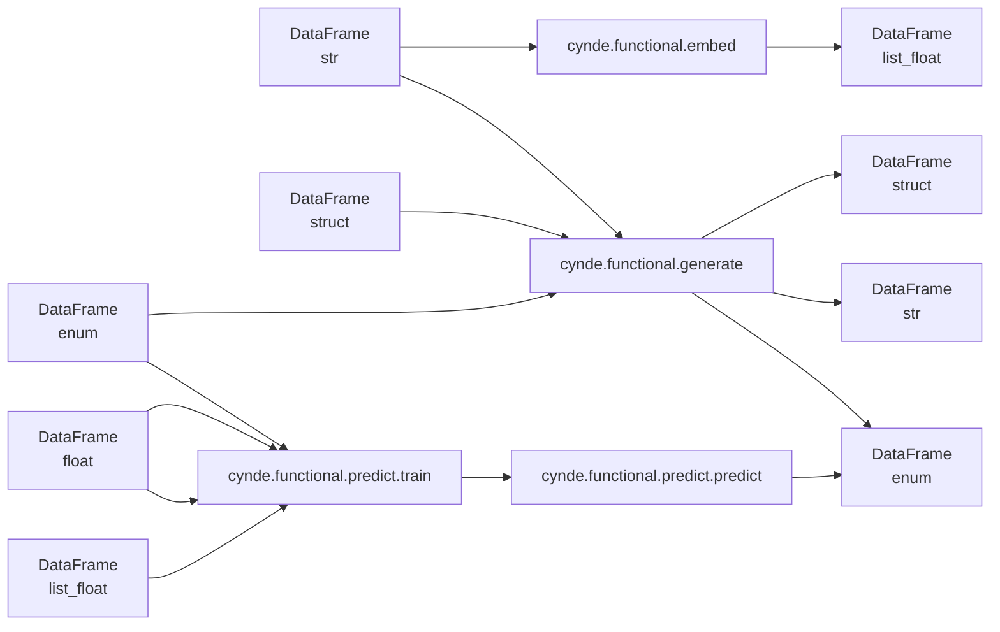
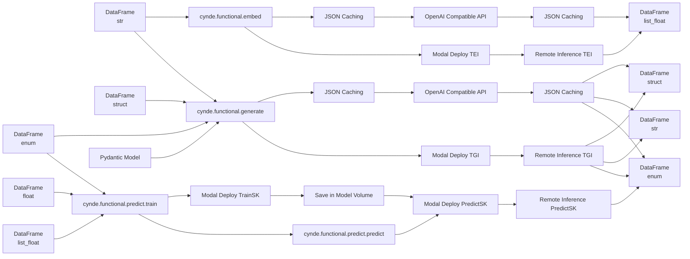

# 🌿✨ Cynde: A Framework for Scalable and Flexible LLM-Powered Data Processing
python -m pip install pathto/Cynde

Hard refactor ongoing, shamelessly pushing to main for interactive debugging with modal image constructions. 
## Introduction

Cynde is a Python framework designed to streamline the integration of large language models (LLMs) with the modern data-science stack like Polars DataFrames and decision tree ensembles for efficient and scalable data processing. The framework provides a set of modular and composable tools for tasks such as embedding generation, structured text generation, and predictive modeling, with a focus on leveraging the power of LLMs and serverless computing.

## Key Features

1. **Serverless LLM Integration**: Cynde seamlessly integrates with serverless computing platforms like Modal for massively parallel LLM processing. It supports both direct API access to popular LLMs like OpenAI's GPT models and self-hosted deployments using open-source models like Meta's LLaMA and Hugging Face's text-generation-inference (TGI) and text-embedding-inference (TEI) servers. These self-hosted deployments are managed by Cynde through Modal, ensuring scalability and efficiency. Additionally, Cynde is compatible with any OpenAI API-compatible remote or local server deployment for embedding generation and structured text generation.

2. **Polars DataFrames**: Built on top of Polars, a fast and efficient DataFrame library for Rust and Python, Cynde leverages lazy evaluation and query optimization to efficiently process large-scale data.

3. **Pydantic Models**: Cynde uses Pydantic, a Python library for data parsing and validation using Python type annotations, to define and validate data structures throughout the framework. Pydantic models are used for configuring LLM interactions, specifying data schemas, and defining pipeline steps.

4. **Functional API**: Cynde exposes a functional API where methods take a DataFrame and a Pydantic object as input and return a DataFrame, a Pydantic object, or a tuple of both. This allows for easy composition of functions and enables thinking in terms of type-based morphisms.

5. **Embedding Generation**: The `cynde.functional.embed` module provides tools for generating embeddings from text data using LLMs. It supports configurable embedding models and caching of results.

6. **Structured Text Generation**: The `cynde.functional.generate` module offers functionality for generating structured text using LLMs based on specified instructions and output schemas. It leverages the TGI server and the Outlines library for constrained text generation, with a focus on generating typed objects.

7. **Predictive Modeling**: The `cynde.functional.predict` module enables predictive modeling tasks, focusing on categorical variables. It includes tools for feature engineering, model training, and evaluation, with support for distributed nested cross-validation of tree ensembles.

## Serverless Deployment and Autoscaling

Cynde leverages Modal for serverless deployment and autoscaling of LLM processing. The framework provides deployment scripts for spinning up TGI and TEI servers on Modal, allowing for efficient and scalable processing of text generation and embedding tasks.

The general design pattern is to push local data to the cloud, where the embedding and text generation servers are deployed. The framework maps the generation and embedding jobs over rows of the DataFrame, with autoscaling to handle large workloads.

## Refactoring Steps

To further enhance the framework, the following refactoring steps are planned:

1. **Simplify OpenAI Scripts**: Move dataclasses to Pydantic models and isolate caching logic into a separate utils module with a configurable schema derived from a Pydantic model. This will allow for easier configuration of the cache format and compatibility with the Modal deployment mode.

2. **Unify Generation and Embedding API**: Refactor the `cynde.functional.generate` and `cynde.functional.embed` modules to use a higher-level Pydantic config that specifies the backend to use (e.g., OpenAI API, Modal deployment). This will provide a more consistent and flexible interface for users.

3. **Refactor Predict Module**: Refactor the `cynde.functional.predict` module to work through the Modal deployment invocation instead of the current `main()` function. Use Modal volumes for handling training data instead of the current mount system, allowing for more efficient data handling and reduced networking overhead. This will enable defining tasks for TEI and TGI directly over datasets already in the volume, rather than processing single inputs. By pushing data as parquet files instead of serializing data for each row, the framework can optimize data transfer and avoid networking bottlenecks, especially in cross-validation scenarios where the same rows are used across multiple folds.

4. **Add Storage and Inference Endpoint**: Extend the Modal deployment to include a storage and inference endpoint for the gradient boosting trees trained in the `train_cv` endpoint. This will enable seamless model persistence and serving.

## Pipeline with Remote References

The next step in the evolution of Cynde is to introduce a pipeline mechanism that allows for the composition of methods through eager invocation from the local machine, where the original data resides. Each step in the pipeline would return a reference to the data that will be used as input for the next step.

To achieve this, we propose introducing a dummy class that represents a reference to a (potentially) remote DataFrame that does not exist in advance. This class would encapsulate the metadata required to locate and load the actual data when needed.

Here's how this pipeline mechanism would work:

1. Each step in the pipeline is triggered from the local machine, where the original data resides.
2. When a step is executed, it returns a dummy object that represents the output DataFrame, rather than the actual data itself.
3. This dummy object contains metadata about the expected remote location and name of the output DataFrame.
4. When the dummy object is passed as input to the next step in the pipeline, the Modal execution environment uses the metadata to locate and load the actual remote DataFrame.

By leveraging this remote reference mechanism, Cynde can enable the composition of complex data processing pipelines that span multiple execution environments (e.g., local machine, Modal) without the need to transfer data back and forth between steps. This approach also allows for lazy evaluation and optimization of the pipeline, as the actual data is only loaded and processed when needed.

To implement this pipeline mechanism, we will need to define a `RemoteDataFrame` class that encapsulates the metadata required to locate and load the remote data. This class will provide methods for saving and loading data to and from remote storage, as well as for specifying the expected schema and transformations applied to the data.

By integrating this remote reference mechanism with the refactored `cynde.functional` modules and the Modal deployment infrastructure, Cynde will provide a powerful and flexible framework for composing and executing complex data processing pipelines that leverage the power of LLMs and serverless computing.

