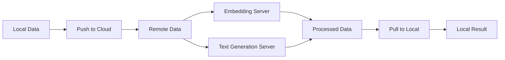
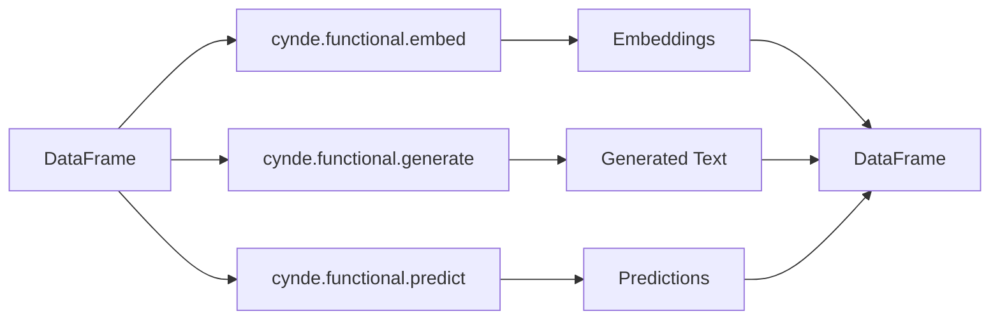
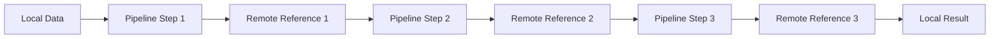

Sure! Let's create several mermaid graphs to illustrate different aspects of Cynde, including the local to remote data flow, the eager vs. pipeline execution models, and the current use of deploy and f.map(inputs).

1. Local to Remote Data Flow (Eager Execution):


2. Local to Remote Data Flow (Pipeline Execution):

```mermaid
graph LR
    A[Local Data] --> B[Push to Cloud]
    B --> C[Remote Data]
    C --> D[Pipeline Step 1]
    D --> E[Remote Reference 1]
    E --> F[Pipeline Step 2]
    F --> G[Remote Reference 2]
    G --> H[Pipeline Step 3]
    H --> I[Remote Reference 3]
    I --> J[Pull to Local]
    J --> K[Local Result]
```


3. Current Use of Deploy and f.map(inputs):
```mermaid
graph TD
    A[Local Data] --> B[Deploy Embedding Server]
    A --> C[Deploy Text Generation Server]
    B --> D[Embedding Server]
    C --> E[Text Generation Server]
    A --> F[f.map(inputs)]
    F --> D
    F --> E
    D --> G[Processed Embeddings]
    E --> H[Generated Text]
    G --> I[Collect Results]
    H --> I
    I --> J[Local Result]
```

4. Cynde Functional Modules:


5. Cynde Pipeline with Remote References:


These mermaid graphs provide a visual representation of various aspects of Cynde, including the data flow between local and remote environments, the difference between eager and pipeline execution models, the current use of deploy and f.map(inputs), the functional modules, and the proposed pipeline mechanism with remote references.