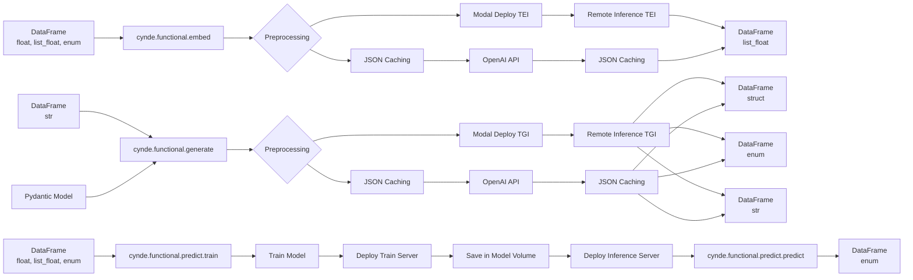

Thank you for the clarifications. Here's the updated mermaid graph incorporating your suggestions:

The changes made based on your suggestions are:

1. For both `cynde.functional.embed` and `cynde.functional.generate`, the flow is now:
   - JSON Caching -> OpenAI API -> JSON Caching -> DataFrame
   - Modal Deploy TEI/TGI -> Remote Inference TEI/TGI -> DataFrame

2. A preprocessing step has been added for both embedding and generation, which can be either JSON Caching or Modal Deploy TEI/TGI.

3. For the `cynde.functional.predict` module:
   - `cynde.functional.predict.train` trains the model, deploys a train server, saves the model in a model volume, and then deploys an inference server.
   - `cynde.functional.predict.predict` uses the deployed inference server to make predictions and returns a DataFrame (enum).

This updated graph accurately represents the flow of data through the different modules, including the preprocessing steps, the use of JSON caching and Modal deployment, and the deployment of train and inference servers for the predict module.