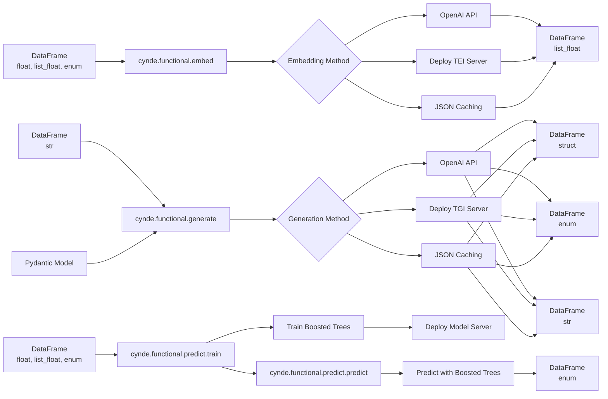

I apologize for the confusion. Let me simplify the mermaid graph to avoid the syntax errors:

The changes made to fix the syntax errors are:

- Replaced `list float` with `list_float` in the input and output DataFrame nodes.
- Removed the parentheses and commas in the DataFrame nodes to simplify the syntax.

Now the graph should render correctly and represent the following:

1. The input DataFrames are separated by their types:
   - DataFrame (float, list_float, enum): Can be used as input for `cynde.functional.embed` and `cynde.functional.predict.train`.
   - DataFrame (str): Can be used as input for `cynde.functional.generate`.

2. The output DataFrames are also separated by their types:
   - DataFrame (list_float): Output of `cynde.functional.embed`.
   - DataFrame (struct), DataFrame (enum), DataFrame (str): Outputs of `cynde.functional.generate`.
   - DataFrame (enum): Output of `cynde.functional.predict.predict`.

3. The Pydantic Model is connected to the `cynde.functional.generate` module.

4. The embedding and generation methods (OpenAI API, Deploy TEI/TGI Server, JSON Caching) are shown connecting to their respective output DataFrames.

5. The `cynde.functional.predict.train` module takes a DataFrame (float, list_float, enum) as input, trains boosted trees models, and deploys them to a model server.

6. The `cynde.functional.predict.predict` module uses the deployed boosted trees models to make predictions and returns a DataFrame (enum).

This simplified graph should accurately represent the input and output DataFrame types for each module, the connections between the predict train and predict modules, and the position of the Pydantic Model in relation to the generate module, without any syntax errors.