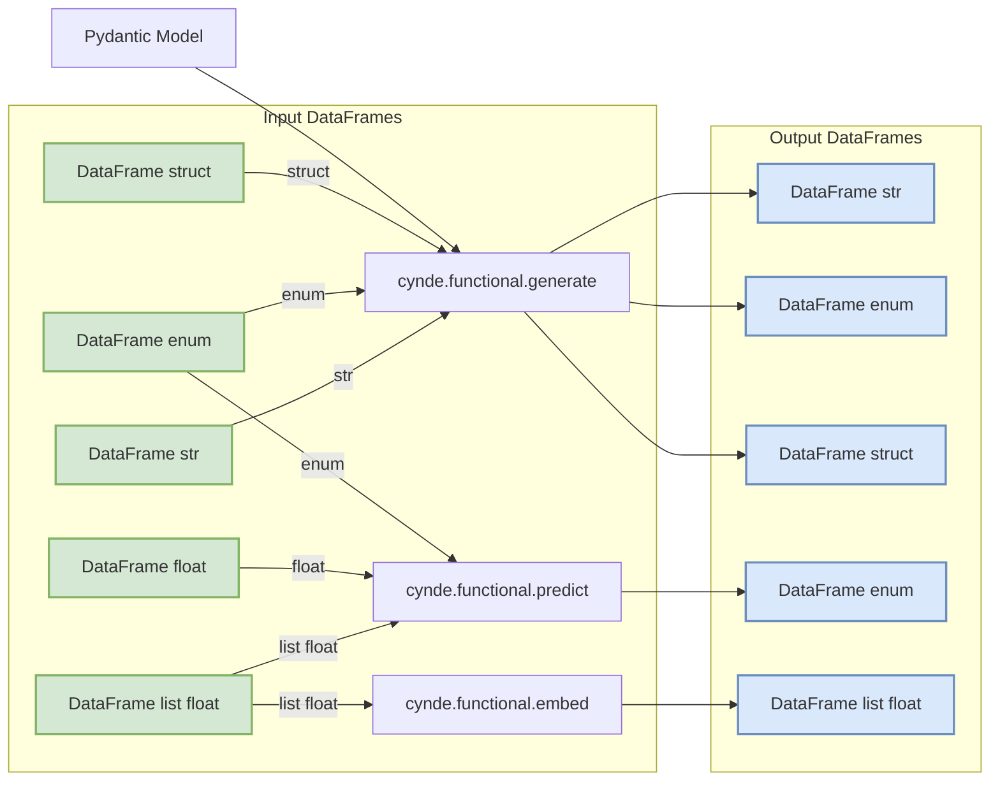

Apologies for the confusion. Let me update the graph based on your design idea:

In this updated graph:

1. The input DataFrames are represented in green and have different types:
   - DataFrame str
   - DataFrame list float
   - DataFrame float
   - DataFrame enum
   - DataFrame struct

2. The output DataFrames are represented in blue and have the same names as the input DataFrames, but with different types based on the output of each module:
   - cynde.functional.generate outputs DataFrame str, DataFrame enum, and DataFrame struct
   - cynde.functional.predict outputs DataFrame enum
   - cynde.functional.embed outputs DataFrame list float

3. The connections between the input DataFrames and the Cynde modules are labeled with the respective types:
   - DataFrame str and DataFrame enum can go into cynde.functional.generate
   - DataFrame list float, DataFrame float, and DataFrame enum can go into cynde.functional.predict
   - DataFrame list float can go into cynde.functional.embed

4. The Pydantic Model is connected to cynde.functional.generate, indicating that it can be used as input for structured generation.

This graph provides a clear overview of the type-safe compositionality of the different methods in Cynde. It shows the allowed input and output types for each module and how they can be combined to create data processing pipelines.