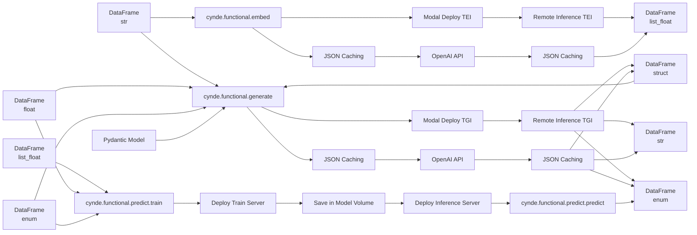

Certainly! Here's the updated mermaid graph with the subgraphs removed and the DataFrame (struct) added as an input to `cynde.functional.generate`:

In this updated graph:

1. The input data types are represented by individual nodes:
   - DataFrame (str) is connected to `cynde.functional.embed` and `cynde.functional.generate`.
   - DataFrame (float), DataFrame (enum), and DataFrame (struct) are connected to `cynde.functional.generate`.
   - DataFrame (float), DataFrame (enum), and DataFrame (list_float) are connected to `cynde.functional.predict.train`.

2. The output data types are represented by individual nodes:
   - DataFrame (str)
   - DataFrame (enum)
   - DataFrame (list_float)
   - DataFrame (struct)

3. The connections between the input nodes and the modules remain the same, with the addition of DataFrame (struct) connected to `cynde.functional.generate`.

4. The output connections remain the same:
   - `cynde.functional.embed` outputs DataFrame (list_float).
   - `cynde.functional.generate` outputs DataFrame (struct), DataFrame (str), and DataFrame (enum).
   - `cynde.functional.predict.predict` outputs DataFrame (enum).

5. The Pydantic Model is connected to `cynde.functional.generate`.

6. The JSON Caching and Modal Deploy TEI/TGI paths are correctly connected to their respective modules and output data types.

This graph accurately represents the flow of data through the different modules, with the input and output data types represented as individual nodes without any subgraphs. The DataFrame (struct) has been added as an input to `cynde.functional.generate`, and the connections between the modules and their respective input and output data types are correctly represented.