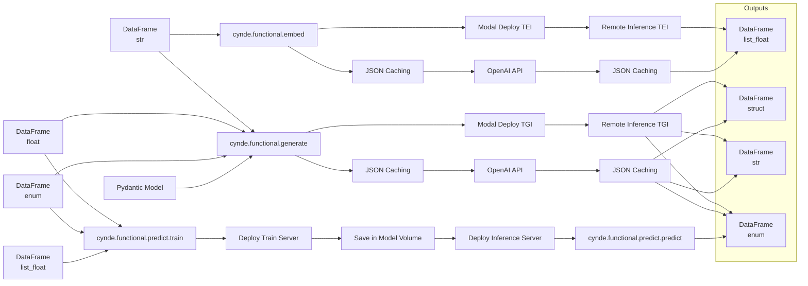

I apologize for the misunderstanding. Here's the updated mermaid graph with a single node for each data type in the input and output sections:

In this updated graph:

1. The input data types are represented by a single node each:
   - DataFrame (str) is connected to `cynde.functional.embed` and `cynde.functional.generate`.
   - DataFrame (float) and DataFrame (enum) are connected to `cynde.functional.generate` and `cynde.functional.predict.train`.
   - DataFrame (list_float) is connected to `cynde.functional.predict.train`.

2. The output data types are represented by a single node each in the "Outputs" subgraph:
   - DataFrame (str)
   - DataFrame (enum)
   - DataFrame (list_float)
   - DataFrame (struct)

3. The output connections have been updated to point to the respective output nodes:
   - `cynde.functional.embed` outputs DataFrame (list_float).
   - `cynde.functional.generate` outputs DataFrame (struct), DataFrame (str), and DataFrame (enum).
   - `cynde.functional.predict.predict` outputs DataFrame (enum).

4. The Pydantic Model is connected to `cynde.functional.generate`.

5. The JSON Caching and Modal Deploy TEI/TGI paths are correctly connected to their respective modules and output data types.

This graph accurately represents the flow of data through the different modules, with a single node for each data type in the input section and a separate "Outputs" subgraph containing a single node for each output data type. The connections between the modules and their respective input and output data types are correctly represented.