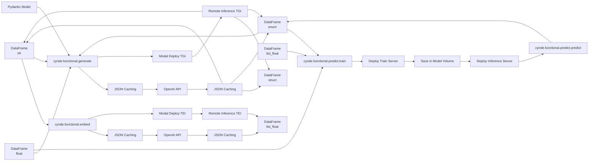

I apologize for the confusion. Here's the updated mermaid graph with a single node per type for both input and output, and the correct connections between the modules:

In this updated graph:

1. There is a single node per type for both input and output:
   - DataFrame (str) is connected to `cynde.functional.embed` and `cynde.functional.generate`.
   - DataFrame (float) and DataFrame (enum) are connected to `cynde.functional.generate` and `cynde.functional.predict.train`.
   - DataFrame (list_float) is connected to `cynde.functional.predict.train`.

2. The output connections have been updated:
   - `cynde.functional.embed` outputs DataFrame (list_float).
   - `cynde.functional.generate` outputs DataFrame (struct), DataFrame (str), and DataFrame (enum).
   - `cynde.functional.predict.predict` outputs DataFrame (enum).

3. The Pydantic Model is connected to `cynde.functional.generate`.

4. The JSON Caching and Modal Deploy TEI/TGI paths are correctly connected to their respective modules and output data types.

This graph accurately represents the flow of data through the different modules, with a single node per type for both input and output, and the correct connections between the modules and their respective input and output data types.