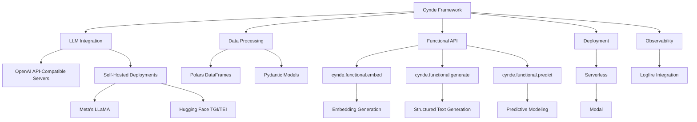

Certainly! Let's take a step back and redesign the mermaid graph to better represent the structure and components of the Cynde framework. Here's a proposed new mermaid graph:

In this redesigned mermaid graph, we have:

1. The Cynde Framework at the center, with arrows pointing to its main components.

2. LLM Integration: This component represents the integration with different LLM backends. It is further divided into OpenAI API-Compatible Servers and Self-Hosted Deployments, with the latter including Meta's LLaMA and Hugging Face TGI/TEI.

3. Data Processing: This component represents the data processing capabilities of Cynde, which leverage Polars DataFrames for efficient data manipulation and Pydantic Models for data validation and schema definition.

4. Functional API: This component represents the core functional modules of Cynde. It is divided into three submodules:
   - `cynde.functional.embed`: Responsible for embedding generation.
   - `cynde.functional.generate`: Responsible for structured text generation.
   - `cynde.functional.predict`: Responsible for predictive modeling.

5. Deployment: This component represents the deployment options for Cynde, focusing on serverless deployment using Modal.

6. Observability: This component represents the observability and monitoring capabilities of Cynde, with Logfire integration for capturing and analyzing runtime behavior and performance metrics.

This redesigned mermaid graph provides a more structured and hierarchical representation of the Cynde framework, clearly separating the main components and their subcomponents. It emphasizes the modular nature of the framework, with the Functional API at the core, supported by LLM Integration, Data Processing, Deployment, and Observability components.

The graph also highlights the specific technologies and libraries used within each component, such as Polars DataFrames and Pydantic Models for data processing, Modal for serverless deployment, and Logfire for observability.

By presenting the framework in this organized manner, the mermaid graph helps users better understand the architecture and capabilities of Cynde, and how the different components work together to enable scalable and flexible LLM-powered data processing workflows.