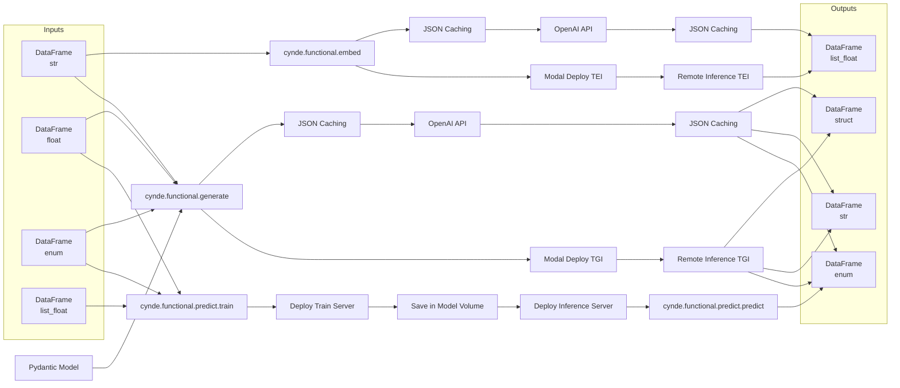

I apologize for the inconsistency in the background color. Here's the updated mermaid graph with the output nodes aligned on the left side and the same background color throughout:

In this updated graph:

1. The input data types are represented by a single node each in the "Inputs" subgraph:
   - DataFrame (str)
   - DataFrame (float)
   - DataFrame (enum)
   - DataFrame (list_float)

2. The output data types are represented by a single node each in the "Outputs" subgraph:
   - DataFrame (str)
   - DataFrame (enum)
   - DataFrame (list_float)
   - DataFrame (struct)

3. The connections between the input nodes and the modules remain the same:
   - DataFrame (str) is connected to `cynde.functional.embed` and `cynde.functional.generate`.
   - DataFrame (float) and DataFrame (enum) are connected to `cynde.functional.generate` and `cynde.functional.predict.train`.
   - DataFrame (list_float) is connected to `cynde.functional.predict.train`.

4. The output connections remain the same:
   - `cynde.functional.embed` outputs DataFrame (list_float).
   - `cynde.functional.generate` outputs DataFrame (struct), DataFrame (str), and DataFrame (enum).
   - `cynde.functional.predict.predict` outputs DataFrame (enum).

5. The Pydantic Model is connected to `cynde.functional.generate`.

6. The JSON Caching and Modal Deploy TEI/TGI paths are correctly connected to their respective modules and output data types.

This graph accurately represents the flow of data through the different modules, with the input and output data types aligned on the left side in their respective subgraphs. The background color is consistent throughout the graph, and the connections between the modules and their respective input and output data types are correctly represented.