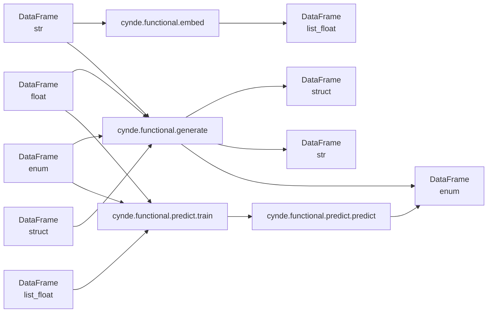

Here's the simplified mermaid graph focusing only on the input and output data types for `cynde.functional.embed`, `cynde.functional.generate`, and `cynde.functional.predict`, without the details of the deployment and sub-methods:

In this simplified graph:

1. The input data types are represented by individual nodes:
   - DataFrame (str) is connected to `cynde.functional.embed` and `cynde.functional.generate`.
   - DataFrame (float), DataFrame (enum), and DataFrame (struct) are connected to `cynde.functional.generate`.
   - DataFrame (float), DataFrame (enum), and DataFrame (list_float) are connected to `cynde.functional.predict.train`.

2. The output data types are represented by individual nodes:
   - DataFrame (str)
   - DataFrame (enum)
   - DataFrame (list_float)
   - DataFrame (struct)

3. The connections between the input nodes and the modules are as follows:
   - DataFrame (str) is connected to `cynde.functional.embed` and `cynde.functional.generate`.
   - DataFrame (float), DataFrame (enum), and DataFrame (struct) are connected to `cynde.functional.generate`.
   - DataFrame (float), DataFrame (enum), and DataFrame (list_float) are connected to `cynde.functional.predict.train`.

4. The output connections are as follows:
   - `cynde.functional.embed` outputs DataFrame (list_float).
   - `cynde.functional.generate` outputs DataFrame (struct), DataFrame (str), and DataFrame (enum).
   - `cynde.functional.predict.predict` outputs DataFrame (enum).

5. The Pydantic Model is connected to `cynde.functional.generate`.

This simplified graph focuses on the input and output data types for the main functional modules of Cynde (`embed`, `generate`, and `predict`) without including the details of the deployment and sub-methods. It clearly shows the connections between the input data types and the modules, as well as the output data types produced by each module.