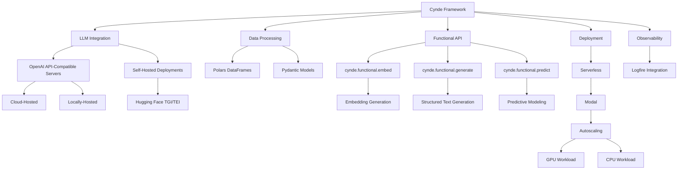

Absolutely! Let's update the mermaid graph to remove the Meta's LLaMA reference, add locally hosted OpenAI servers, and provide more details on Modal autoscaling and deployment. Here's the updated mermaid graph:

In this updated mermaid graph:

1. LLM Integration:
   - The OpenAI API-Compatible Servers are now divided into Cloud-Hosted and Locally-Hosted options, providing flexibility for users to choose between using cloud-based OpenAI servers or running their own locally-hosted instances.
   - The Self-Hosted Deployments now only include Hugging Face TGI/TEI, emphasizing the framework's compatibility with popular open-source models and inference servers.

2. Data Processing and Functional API remain the same as in the previous graph.

3. Deployment:
   - The Serverless deployment option is now explicitly linked to Modal.
   - Under Modal, we have added Autoscaling to highlight Modal's capability to automatically scale the workload based on demand.
   - Autoscaling is further divided into GPU Workload and CPU Workload, indicating that Modal can efficiently scale both GPU-intensive tasks (such as LLM inference) and CPU-intensive tasks (such as data processing and preprocessing).

4. Observability remains the same, with Logfire Integration for monitoring and analyzing the runtime behavior and performance of Cynde workflows.

This updated mermaid graph provides a more accurate and detailed representation of the Cynde framework's architecture and capabilities. It emphasizes the flexibility in LLM integration, with both cloud-hosted and locally-hosted OpenAI API-compatible servers, as well as self-hosted deployments using Hugging Face TGI/TEI.

The graph also highlights the serverless deployment option using Modal, with a focus on Modal's autoscaling capabilities for efficiently handling both GPU and CPU workloads. This ensures that Cynde can seamlessly scale to accommodate varying demands and workload sizes without manual intervention.

By presenting the framework in this manner, the mermaid graph helps users better understand the deployment and scaling options available in Cynde, and how they can leverage Modal's autoscaling features to build scalable and cost-effective LLM-powered applications.