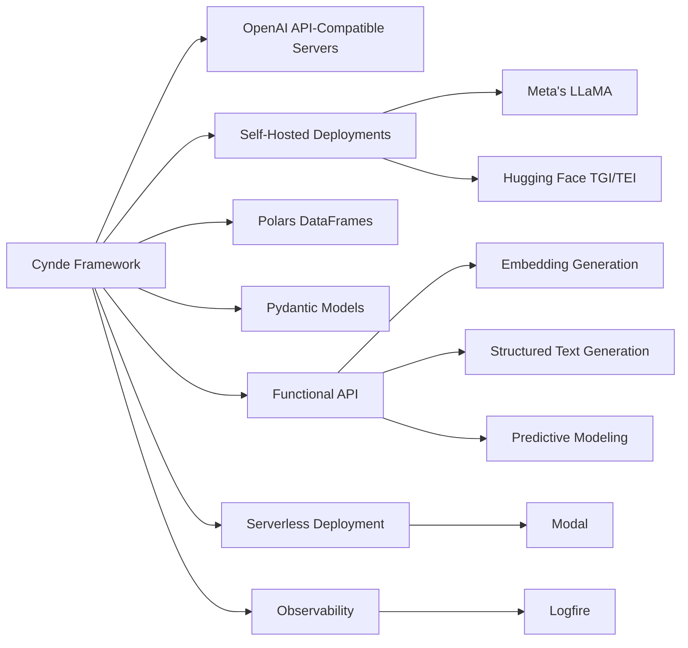

```mermaid
graph LR
    A[Cynde Framework] --> B[OpenAI API-Compatible Servers]
    A --> C[Self-Hosted Deployments]
    C --> D[Meta's LLaMA]
    C --> E[Hugging Face TGI/TEI]
    A --> F[Polars DataFrames]
    A --> G[Pydantic Models]
    A --> H[Functional API]
    H --> I[Embedding Generation]
    H --> J[Structured Text Generation]
    H --> K[Predictive Modeling]
    A --> L[Serverless Deployment]
    L --> M[Modal]
    A --> N[Observability]
    N --> O[Logfire]
```