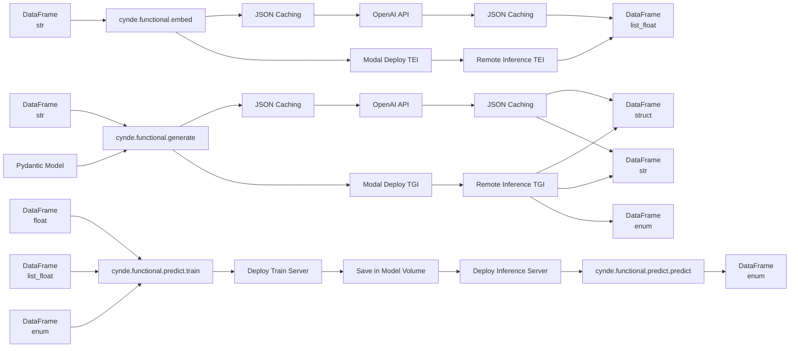

Thank you for the further clarifications. Here's the updated mermaid graph incorporating your latest suggestions:

The changes made based on your latest suggestions are:

1. The preprocessing nodes have been removed, and `cynde.functional.embed` and `cynde.functional.generate` are now directly connected to the JSON Caching and Modal Deploy TEI/TGI paths.

2. The "Train Model" node has been removed as it was redundant.

3. Instead of having a single node with all the types for each input, there are now separate nodes for each type:
   - DataFrame (str) is connected to `cynde.functional.embed` and `cynde.functional.generate`.
   - DataFrame (float), DataFrame (list_float), and DataFrame (enum) are connected to `cynde.functional.predict.train`.

4. In the output of `cynde.functional.generate`, the DataFrame (enum) has been moved to the bottom.

5. The output of `cynde.functional.predict.predict` is now connected to the DataFrame (enum) node.

6. The input for `cynde.functional.embed` has been updated to only accept DataFrame (str).

This updated graph accurately represents the flow of data through the different modules, with separate input nodes for each data type, the removal of redundant nodes, and the correct connections between the modules and their respective input and output data types.