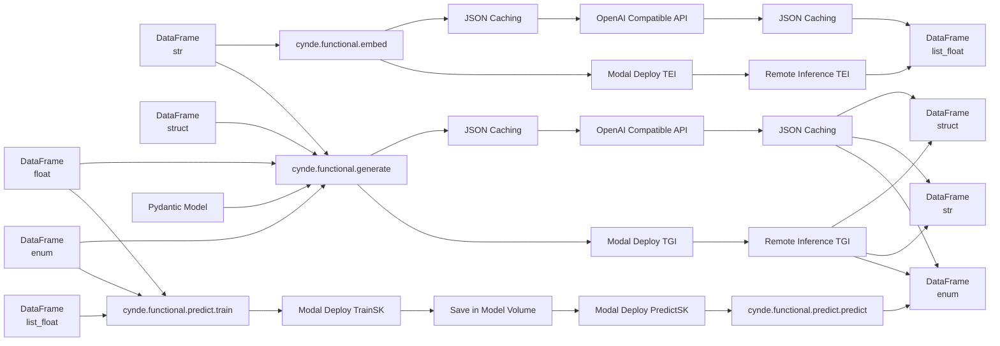

Apologies for the oversight. Here's the updated mermaid graph with DataFrame (struct) added as an input to `cynde.functional.generate` and DataFrame (list_float) positioned at the bottom:

In this updated graph:

1. The input data types are represented by individual nodes:
   - DataFrame (str) is connected to `cynde.functional.embed` and `cynde.functional.generate`.
   - DataFrame (float), DataFrame (enum), and DataFrame (struct) are connected to `cynde.functional.generate`.
   - DataFrame (float) and DataFrame (enum) are connected to `cynde.functional.predict.train`.
   - DataFrame (list_float) is connected to `cynde.functional.predict.train` and positioned at the bottom.

2. The output data types are represented by individual nodes:
   - DataFrame (str)
   - DataFrame (enum)
   - DataFrame (list_float)
   - DataFrame (struct)

3. The connections between the input nodes and the modules have been updated to include DataFrame (struct) connected to `cynde.functional.generate`.

4. The output connections remain the same:
   - `cynde.functional.embed` outputs DataFrame (list_float).
   - `cynde.functional.generate` outputs DataFrame (struct), DataFrame (str), and DataFrame (enum).
   - `cynde.functional.predict.predict` outputs DataFrame (enum).

5. The Pydantic Model is connected to `cynde.functional.generate`.

6. The JSON Caching and Modal Deploy TEI/TGI paths are correctly connected to their respective modules and output data types.

This graph accurately represents the flow of data through the different modules, with DataFrame (struct) added as an input to `cynde.functional.generate` and DataFrame (list_float) positioned at the bottom as it can only be used in `cynde.functional.predict.train`. The connections between the modules and their respective input and output data types are correctly represented.