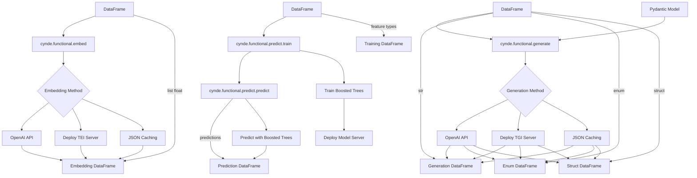

Here's the updated mermaid graph incorporating your suggestions:

In this updated graph:

1. There are three separate DataFrames for each type of data:
   - Embedding DataFrame (`list float`)
   - Generation DataFrame (`str`, `enum`, `struct`)
   - Training DataFrame (`feature types`)

2. The `cynde.functional.embed` module takes a DataFrame as input and outputs an Embedding DataFrame (`list float`).

3. The `cynde.functional.generate` module takes a DataFrame as input and outputs a Generation DataFrame, which can be of type `str`, `enum`, or `struct`. The Pydantic Model is positioned on the right side of the DataFrame input to the generate module.

4. The `cynde.functional.predict.train` module takes a DataFrame with `feature types` as input and trains boosted trees models, which are then deployed to a model server.

5. The `cynde.functional.predict.predict` module uses the deployed boosted trees models to make predictions, which are then returned as a Prediction DataFrame.

6. The different embedding and generation methods (OpenAI API, Deploy TEI/TGI Server, JSON Caching) are shown connecting to their respective output DataFrames, illustrating the two mapping directions discussed earlier.

This updated graph provides a clearer representation of the different data types, the position of the Pydantic Model in relation to the generate module, and the connections between the predict train and predict modules.