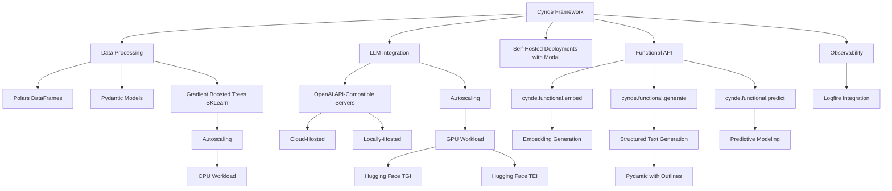

Here's the updated mermaid graph based on your requirements:

In this updated mermaid graph:

1. The Cynde Framework node is at the top, with Data Processing, LLM Integration, Self-Hosted Deployments with Modal, Functional API, and Observability as its direct children.

2. Under Data Processing:
   - Polars DataFrames and Pydantic Models remain as key components.
   - Gradient Boosted Trees SKLearn is connected to Autoscaling, which leads to CPU Workload, indicating that gradient boosting tasks are scaled using CPU resources.

3. LLM Integration is now a child of the Cynde Framework node:
   - OpenAI API-Compatible Servers are divided into Cloud-Hosted and Locally-Hosted options.
   - LLM Integration is connected to Autoscaling, which leads to GPU Workload.
   - GPU Workload is then connected to Hugging Face TGI and Hugging Face TEI, indicating that these self-hosted deployments are scaled using GPU resources.

4. Self-Hosted Deployments with Modal is now a separate child of the Cynde Framework node, representing the deployment aspect of the framework.

5. The Functional API and its submodules (cynde.functional.embed, cynde.functional.generate, and cynde.functional.predict) remain the same, with Structured Text Generation connected to Pydantic with Outlines.

6. Observability and its connection to Logfire Integration remain unchanged.

This updated mermaid graph better represents the relationships between the different components of the Cynde framework. It highlights the separation of data processing, LLM integration, and self-hosted deployments, while also showing the connection between gradient boosted trees and CPU workload, as well as the connection between LLM integration, GPU workload, and the self-hosted deployments of Hugging Face TGI and TEI.